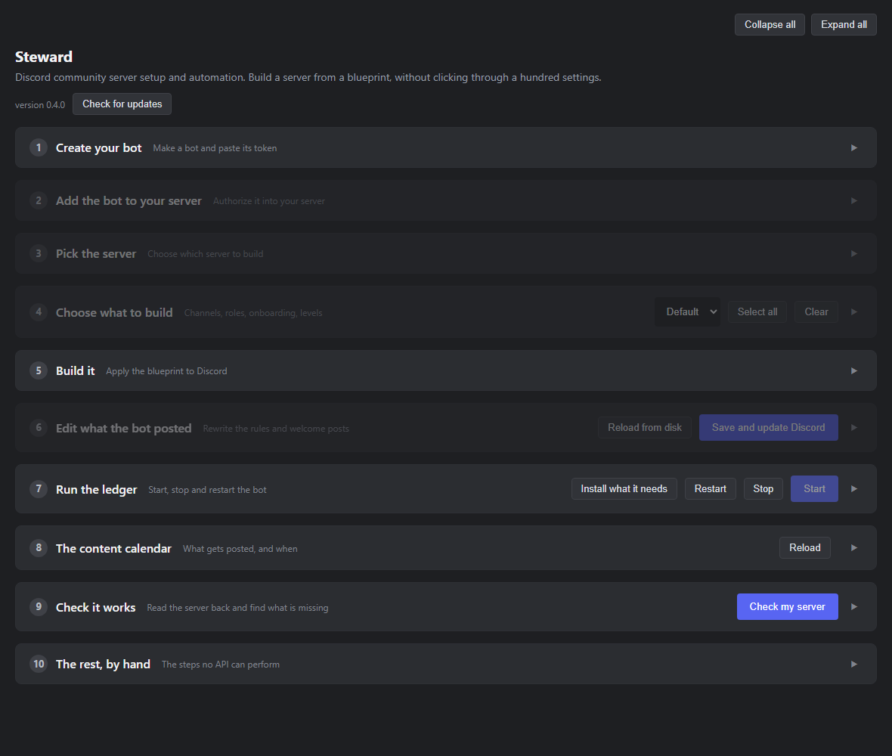
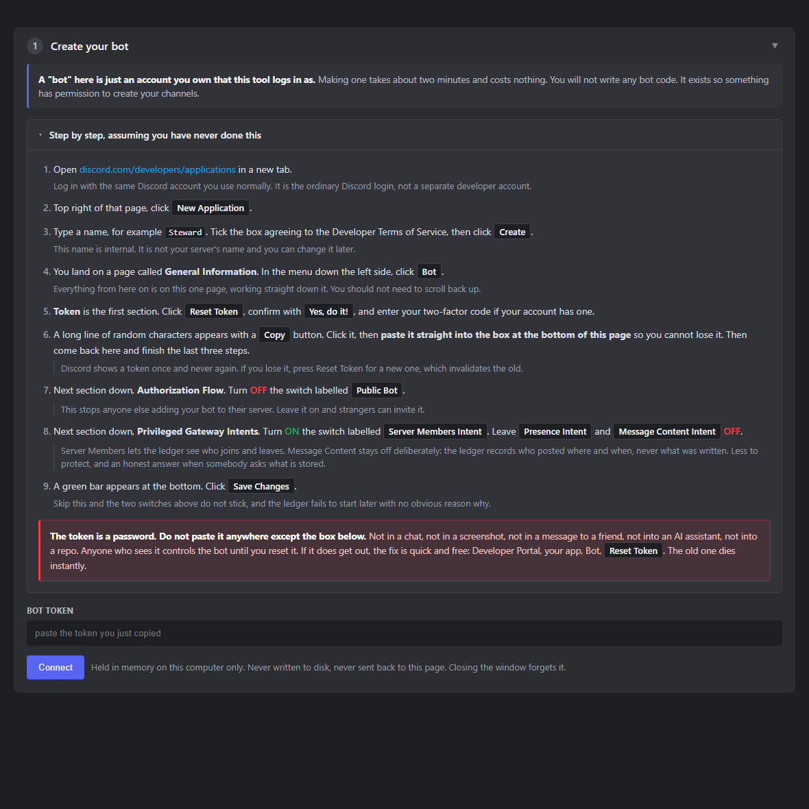
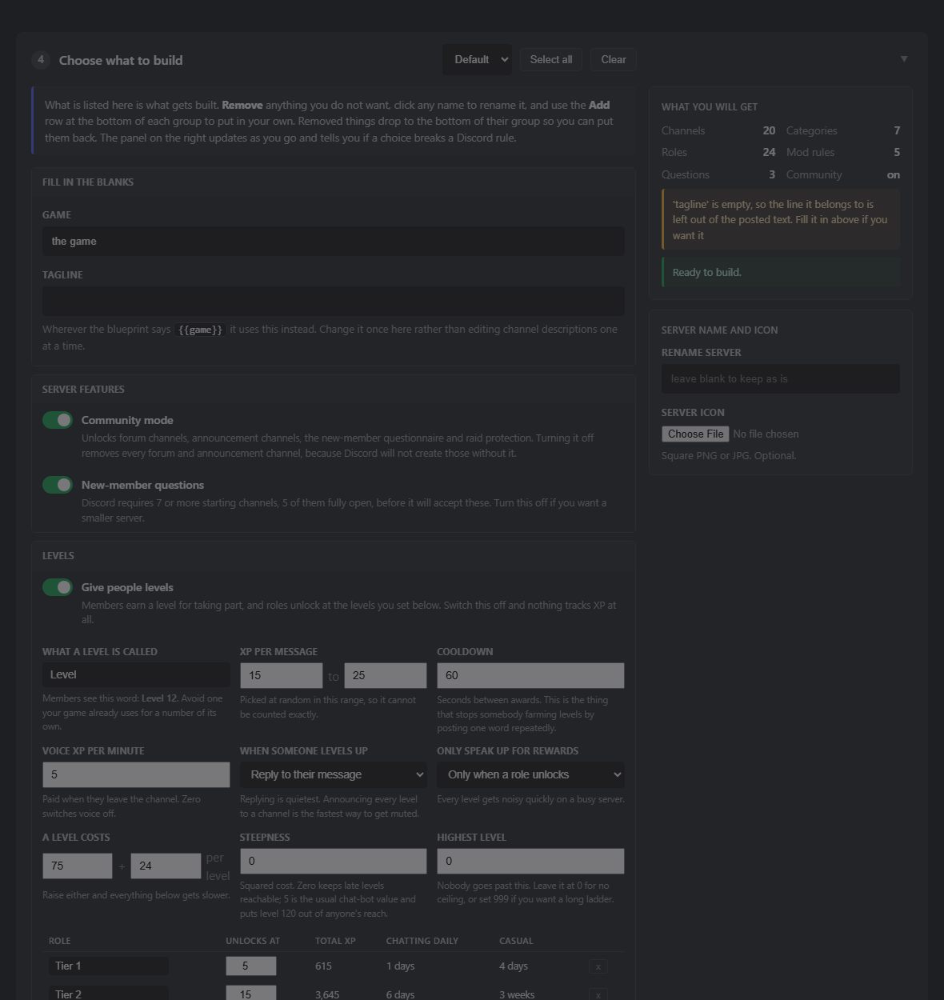
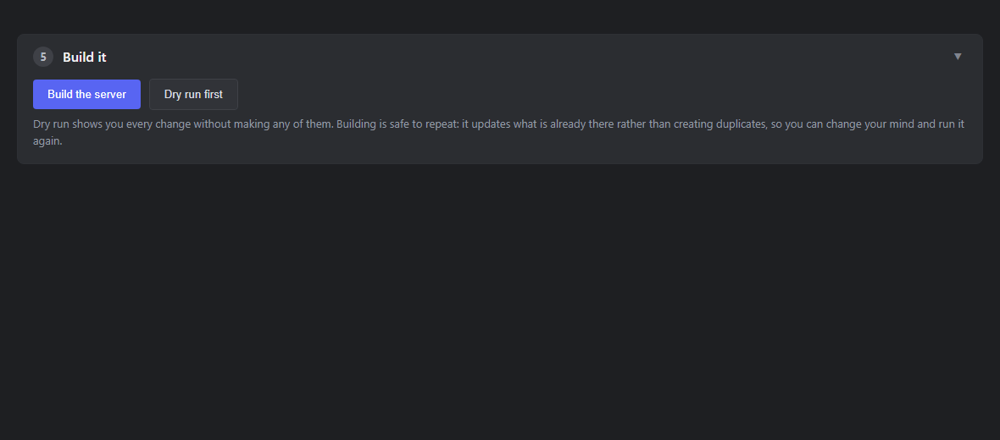
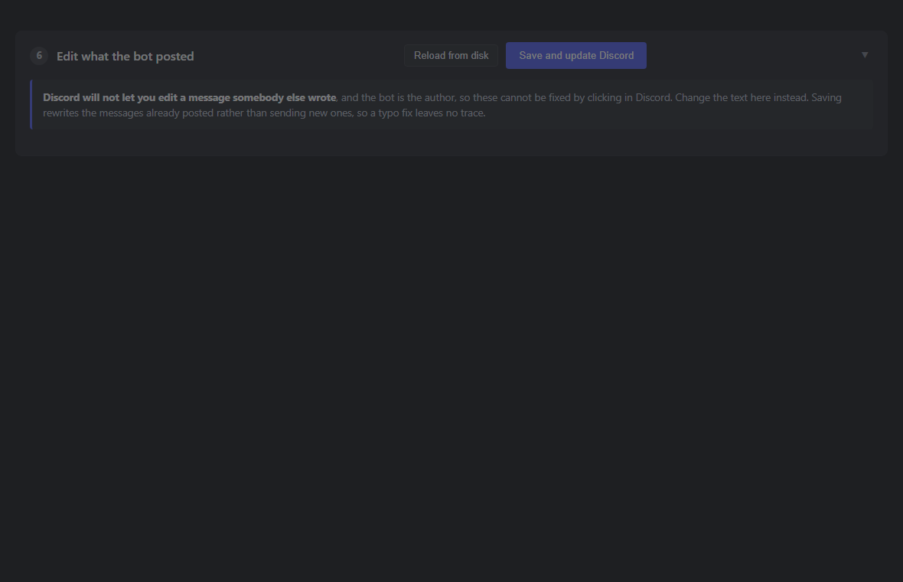
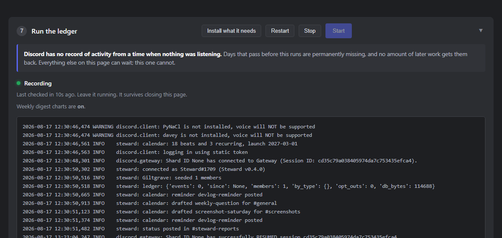
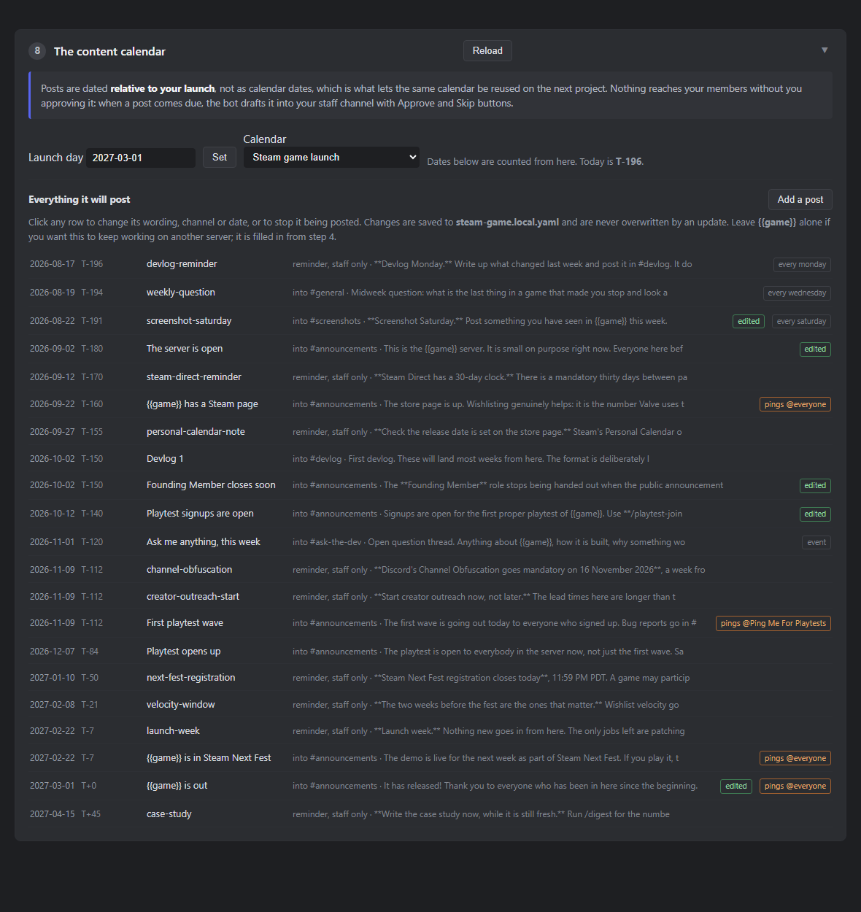
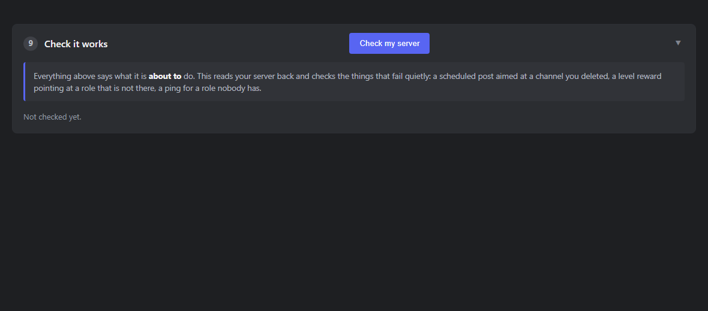
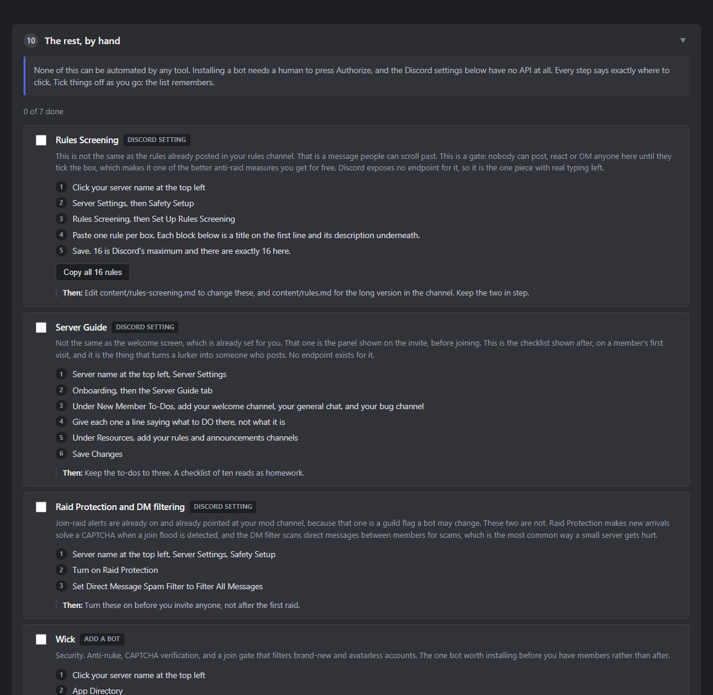

# Steward

**Set up a Discord community server properly, without clicking through a
hundred settings.** Channels, roles, permissions, onboarding, AutoMod and a
rules document, built from a spec you can edit, plus a bot that records what
happens afterwards so you can tell whether any of it worked.

Free, open source, and it runs on your own machine. Nothing is hosted, and
your bot token never leaves your computer.

---

## Getting it

**Windows, no Python needed.** Download `Steward-<version>-windows.zip` from
[the releases page](https://github.com/SageHargrove/Steward/releases),
unzip it anywhere, and double-click **`Steward.bat`**. Your browser opens on
the setup page. Run `INSTALL.bat` once if you want it on the Start Menu.

The download carries its own copy of Python. It is not installed, it is not
added to PATH, and it cannot conflict with anything already on the machine.
Deleting the folder removes it completely.

> **Windows will warn you the first time.** The download is not code-signed,
> because a certificate costs a few hundred a year and this is free software.
> If you see a blue "Windows protected your PC" panel, click **More info**,
> then **Run anyway**. If your browser blocks the zip, choose **Keep**. You can
> read every line of what you are running in this repository.

**Linux and macOS, or if you already have Python:** clone the repository and
run `./start.sh` or `START.bat`.

**On a server, so it runs while your PC is off:** [SERVER.md](SERVER.md) — a
venv, one `.env` line, and a systemd unit. Run the bot in exactly one place.

---

## What it looks like

Ten steps, folded by default, because somebody coming back needs three of them.



Every screenshot below is the real page, taken with `tools/screenshots.py`
rather than drawn, so they go stale the moment the program does.

---

### It assumes you have never made a Discord bot

The Developer Portal walkthrough is built in, in the order the page actually
appears, and it generates your invite link once you paste a token.



### Everything is a list you can edit

Remove what you do not want, click any name to rename it, add your own. The
panel on the right recounts as you go and tells you when a choice breaks one of
Discord's rules, before anything is sent.

The levels table is the same arithmetic the bot runs, so it shows what your
curve really costs in XP **and in days**, for a chatty member and a casual one.
"Level 120" means nothing until you know it is fifteen years away.



### It builds, and re-building is normal

Roles, then plain channels, then Community mode, then forum and announcement
channels, then AutoMod, then onboarding. That order is not arbitrary: Discord
refuses forum channels before Community mode, and Community mode before a rules
channel exists. Re-running edits what is there rather than duplicating it.



### It writes the words, and you rewrite them here

A real 16-rule document and a welcome post, posted and pinned. Discord will
not let you edit a message the bot wrote, so they are edited here instead, and
saving rewrites the message already in Discord rather than posting a second one.



### The bot runs from the page

Install, start, stop and restart, with the log underneath. Started here it runs
detached, so closing the page leaves it recording.



### A content calendar that asks first

One calendar per kind of project. Posts are dated relative to your launch, every
one is editable in place, and **nothing reaches your members without you
clicking Approve**.



### It checks its own work

The only part of the page that reads your server back rather than describing
what it would write. It finds the things that fail quietly: a post aimed at a
channel you renamed, a level reward pointing at a role nobody made, a ping for a
role that does not exist.



### And it is honest about what it cannot do

Rules Screening, Raid Protection and installing other bots have no API at all.
The list says exactly where to click, and remembers what you have ticked off.



---

## What it actually does

**Builds the server.** Roles, categories, channels including forum and
announcement types, permission overwrites, forum tags, AutoMod rules,
onboarding questions, the welcome screen. Discord's own server templates drop
about half of that; this does not. Re-running edits what is there rather than
duplicating it, so changing your mind is the normal path and not a recovery.

**Writes the words.** A real 16-rule document with an enforcement ladder, and a
welcome post. Posted and pinned for you, editable in the page afterwards,
and it rewrites the message already in Discord rather than posting a second one.

**Remembers what happened.** Discord has no per-member last-active field, so
nobody can tell you who quietly stopped showing up unless something was
recording from day one. That is the bot. It cannot be backfilled, which is why
it is worth starting before you need it.

**Runs the place.** Levels and role rewards, a weekly digest with retention by
join cohort, a moderation log, a content calendar that drafts posts for your
approval on a schedule relative to your launch, a playtest pipeline with key
issuance, and an alert when a channel goes quieter than its own baseline.

**Asks permission.** Nothing is posted to your members without a human
clicking. The bot never sends an unsolicited direct message to anyone.

**Lets members pick their own roles, with nothing running.** The onboarding
questions are not only asked on the way in: Discord keeps every one of them in
the Channels & Roles tab at the top of the channel list, so a question that
hands out a ping role is a self-serve panel that cannot break. No reaction-role
bot, nothing to keep online.

**Leaves out what you already have.** Every part of that last paragraph has an
on/off switch in step 7. A server that already runs MEE6 switches levels off
and keeps everything else; one that posts its own announcements switches the
calendar off. Switching a part off also keeps its channels, roles and
onboarding question out of the build, so you are not left with a
`#playtest-lounge` nobody will ever use. The ledger is the exception and has no
switch: Discord keeps no record of who was active when, so a day it does not
run is a day nobody can get back.

---

## What it deliberately does not do

- **Create the server.** Discord no longer lets bots do that. You make the
  server; this fills it in.
- **Install other bots.** Every one is a permission flow needing a human to
  press Authorize.
- **Read your members' messages.** It never asks Discord for permission to,
  so it records who posted where and when, and never what was said.
- **Moderate.** It logs what moderators did. Anti-nuke and CAPTCHA verification
  are security-critical and hard, and a half-built version is worse than none;
  those stay with Wick.

---

## For developers

The planning documents are in [docs/build-plan.md](docs/build-plan.md) and
[docs/roadmap.md](docs/roadmap.md). The rest of the repository is the
implementation.

```
blueprint/default.yaml      the server spec. Channels, roles, permissions,
                            forum tags, onboarding prompts, AutoMod rules
blueprint/steam-game.yaml   variants. Each states only its differences
blueprint/roblox-game.yaml    from the one it extends, using `extends:`,
blueprint/roblox-gacha.yaml   `remove:`, `rename:`, `add:`, `set:`, `move:`
blueprint/mod.yaml
blueprint/calendars/        what gets posted and when, dated relative to
                            launch. One per kind of project: general,
                            steam-game, roblox-game, mod
provision/core.py           load, template, customize, validate, apply.
                            The CLI and the page both import this
provision/provision.py      command-line wrapper
provision/updates.py        version, update check, update apply
ui/app.py                   the local setup page
steward/                    the bot. Ledger, levels, digest, moderation log,
                            calendar engine, playtest pipeline, decay
install/                    Start Menu shortcuts, and an Inno Setup script
tools/build_dist.py         assemble the no-Python-needed download
tools/screenshots.py        retake the README screenshots
tools/release.py            cut a version: bump, tag, push, publish
VERSION                     the single source of truth for what you are on
SETUP.md                    the runbook
```

The page is ten numbered steps, with the Developer Portal walkthrough built in
so it assumes you have never made a bot before, and it generates your invite
link once you paste a token. The CLI does the same job with flags.

```powershell
python tools\build_dist.py --clean --zip            # just the download, 29 MB zipped
python tools\release.py 0.4.1 --notes "..." --build  # bump, tag, push, publish, attach
python tests\run_tests.py                           # 274 checks, no framework
```

## State

| | |
|---|---|
| Blueprint | validates clean: 24 roles, 20 channels, 7 categories, 5 AutoMod rules, 3 onboarding prompts |
| Core | verified against a stubbed Discord API: phase ordering, idempotency (second run makes 0 creates, 45 updates), dry-run writes nothing |
| UI | boots and serves; connect / invite / refresh / customize / apply / cleanup all exercised against a stubbed API |
| Ledger | logic smoke-tested against a temp database |
| Calendar | 18 one-off posts and 3 recurring, resolving against a 2027-03-01 launch and validated against the blueprint's own channels and roles |
| Playtest | key issuance, reissue, revoke and forget-me exercised against a temp database |
| Decay | the maths exercised against seeded ledgers, including the quiet-week and dominant-channel cases |
| Updates | version compare, backup-before-overwrite and fast-forward exercised against a throwaway pair of repos |
| Server | applied against a live guild. Roles, channels, Community mode, AutoMod and onboarding all created; the calendar and playtest commands have not yet run against one |

Section 0 of [SETUP.md](SETUP.md) is the first thing that does, and
[docs/whats-left.md](docs/whats-left.md) is what stands between this and
somebody else using it.

## What cannot be automated, and why

Worth knowing before you look for a button that is not there. Checked against
the current API rather than assumed:

- **Creating the server.** `create_guild` is restricted to bots in fewer than
  10 guilds and is deprecated for removal. Guild ownership transfer is
  deprecated too, with the reason given as *"bots can no longer own guilds."*
  So you make the server; this tool fills it in.
- **Installing other bots.** Each is an OAuth flow needing a human with Manage
  Server to click. Every server-blueprint product ever built has this step.
- **Rules Screening, Server Guide, Raid Protection.** No API surface at all.

Everything else in the blueprint is automated, including the parts Discord's
own server templates drop.

## The three layers

From the build plan, unchanged:

1. **Blueprint** — the architecture, written as a spec rather than as clicks.
   `blueprint/default.yaml`.
2. **Configured stack** — native Discord plus four free bots (Sapphire, Wick,
   Statbot, Steamy). Section 3 of the runbook. Do not build what Sapphire
   already does for free.
3. **Steward** — the custom bot. The proactive layer, which is the part that
   does not exist in any product today. Staged over months.

Layer 3 is the eventual product. Layers 1 and 2 are what make the server good
next week.

## Why the provisioner exists early

The build plan says build the provisioner last, and the reasoning is sound:
a provisioner that deploys an unvalidated blueprint makes the same mistakes
twice. It is here anyway for two reasons that do not contradict that.

It saves a day of clicking, and more importantly it forces the blueprint to be
executable rather than descriptive. A spec you have never run is a document,
and a document is not the thing you sell. Discord's own server templates are
not an alternative: they capture roles, channels, permission overwrites and
server settings, but explicitly not forum, announcement or stage channels, not
bots, not AutoMod rules, and not onboarding configuration. Roughly half this
blueprint is in the part templates drop.

What stays deferred is everything downstream of one server: multi-guild
management, a config UI, drift detection. Those wait until server #2 exists.

## Why the ledger is stage one

Discord's API has no per-member last-active field. `joined_at`, roles,
nickname, flags, and nothing about activity. No `last_seen`, no
`last_message_at`. Every "who went quiet" feature ever built is derived from an
event stream someone recorded themselves, which is why Statbot's value is its
historical database rather than its API access, and why its free tier caps
history at 30 days.

You cannot backfill it. Data not recorded on day one is gone. That single fact
is why the least visible thing in the plan goes first.

Steward deliberately does **not** request the `MESSAGE_CONTENT` intent.
`on_message` fires without it and only the content field comes back empty. The
ledger records who posted where and when, never what was said. Less to
protect, an honest answer when a member asks what is stored, and no annual
reapplication once the app passes 10,000 users.

## Playbook artifacts

The documentation is the deliverable, not the notes. Written in the same sitting
as the work, not reconstructed afterward. All of them now exist:

- [x] `blueprint/default.yaml` — the machine-readable server spec
- [x] `SETUP.md` — the runbook, including the manual steps and why they are manual
- [x] `blueprint/content-calendar.yaml` — T-minus-relative posts. The single
      most reusable artifact in the set, and the one the calendar engine reads
- [x] [docs/onboarding-flow.md](docs/onboarding-flow.md) — the three questions,
      what each answer grants, and the API rule that forced the design
- [x] [docs/moderation.md](docs/moderation.md) — AutoMod config, the real API
      limits, the escalation ladder, what is left to humans
- [x] [docs/playtest-pipeline.md](docs/playtest-pipeline.md) — recruitment,
      gating, key handling, feedback routing, and the Steam constraints
- [x] [docs/outreach.md](docs/outreach.md) + `docs/outreach-tracker.csv` —
      creators and press. A tracking artifact, not an automation: outreach by
      Discord DM is prohibited

Three of them end with a section that is deliberately empty: what actually
happened. Those get filled in as it happens, and they are the half a studio
would pay for. The config above is copyable; the record of what the rules turned
out to be wrong about is not.

The discipline that makes or breaks this is writing the reusable version in the
same sitting you do the thing. After launch you write a worse version from
memory, and the memory smooths out exactly the parts that were hard, which are
the parts a studio would pay for.

## Running things

```powershell
# the only file you need to run. Everything else is a button on the page,
# including starting, stopping and restarting the bot.
START.bat          # Windows
./start.sh         # Linux and macOS

# or the command line
cd provision
python provision.py --blueprint ..\blueprint\default.yaml --validate
python provision.py --blueprint ..\blueprint\default.yaml --manual

$env:DISCORD_TOKEN = "..."
python provision.py --guild SERVER_ID --blueprint ..\blueprint\default.yaml --dry-run
python provision.py --guild SERVER_ID --blueprint ..\blueprint\default.yaml `
    --var game="One Trick" --server-name "One Trick"

# the ledger, the calendar and the playtest pipeline: all one process
cd ..\steward
python bot.py
```

## Customizing without editing YAML

The UI reads the blueprint and turns it into a form, so someone who wants
`#general`, `#bug-reports` and nothing else gets exactly that. Three mechanisms
make that safe:

**Fill in the blanks.** Anything written `{{game}}` in the blueprint becomes a
form field. This is what makes a blueprint redeployable to the next project
rather than being a config file for one server.

**Removals clean up after themselves.** Drop the `Playtester` role and every
permission overwrite naming it, every onboarding answer granting it, and every
AutoMod exemption listing it are pruned automatically. Renaming `#mod-log`
retargets the four AutoMod alerts and the safety-alerts setting that point at
it. Those are mechanical consequences, not user errors, so they never surface
as validation failures.

**Change a channel's type and permissions in place.** Every row has a type
dropdown and a who-can-post dropdown, so turning `#trading` into a forum is
one click. It used to mean removing it and adding a channel of the same
name, which the page then refused because the name was taken.

**Add, remove, rename.** The list shown is what gets built. Remove drops an item
to the bottom of its group so it can be put back; the Add row at the foot of each
group takes your own channels and roles; every name is an editable field. Nothing
is a greyed-out checkbox, and the handful of genuinely unavoidable items say
"cannot remove" with the reason next to them.

**Cleaning up what Discord left.** Every new server arrives with a Text Channels
category, a Voice Channels category and a General voice channel. The tool reads
the server, hides anything the blueprint adopts by name, and offers the rest for
deletion. Nothing is deleted unless explicitly ticked, and @everyone, bot
integration roles, and anything the run just created are refused outright.

**Live validation on every toggle.** Discord's real constraints are checked
before anything is sent, with messages that say what to do: onboarding's 7
defaults / 5-fully-open rule, AutoMod's per-trigger ceilings, regex over 260
characters, timeout actions on triggers that do not support them, and forum
channels selected while Community mode is off. Apply stays disabled until the
errors are gone.

A few things cannot be unticked, and say why on hover: `#rules` and
`#server-updates` while Community mode is on, because Discord will not enable
Community without them. Turn Community off and they become optional like
anything else.

`--validate` catches the failures that are otherwise opaque 400s halfway
through a run: unknown permission names, undeclared roles in overwrites,
Discord's onboarding channel minimums (7 defaults, 5 of them fully open),
AutoMod per-trigger limits, regex over 260 characters, and timeout actions on
trigger types that do not support them.

## What it writes for you

The rules and the welcome post are real documents, not placeholders, and the
tool posts and pins them:

```
blueprint/content/rules.md        16 rules, an enforcement ladder, and the
                                  list of things that skip it
blueprint/content/welcome.md      what this is, where things happen, which
                                  roles to pick up, what the ledger records
```

Edit the markdown and re-run; it edits the messages already there rather than
posting duplicates, and deletes any it previously posted that the file no
longer contains. A line containing only `<!-- split -->` starts a new Discord
message, because Discord caps a message at 2000 characters and the provisioner
refuses to send anything longer. `{{game}}` works inside these files too.

It also sets the welcome screen, points Discord's join notices at `#general`,
silences the setup-tip nagging, sets an AFK channel and turns on the boost
progress bar. All of those have endpoints that most guides tell you to click
through by hand.

## What a role colour can actually be

Worth knowing before designing a tier ramp, because the limits are lower than
most people expect.

| | needs boosts |
|---|---|
| Any solid hex colour | no |
| A fade between two hex colours you pick | 3 boosts |
| Discord's animated sheen, in colours Discord fixes | 3 boosts |

That is the whole list. **There is no glow, no halo, no drop shadow, and no
custom animation at any boost level**, so an effect built in CSS elsewhere will
not transfer. A role name is one colour, or a fade between two, or the one
animated style Discord ships.

The tiers in this blueprint are therefore exact solid colours that work on a
server with zero boosts, and only the top one asks for the animated style. On a
server without boosts it falls back to its plain colour, which is also what
Discord does by itself if boosts later lapse.

Every role's colour is editable in the setup page, not only ones you add, with
the name drawn in its own colour so a ramp can be judged where it is set.

## One bot instead of four

A server that installs a leveling bot, a stats bot and a logging bot ends up
with three copies of its own activity sitting in three companies' databases.
Steward already has the data, so it does those jobs too.

**Levels, with the maths shown.** The setup page prints what your curve and
thresholds actually cost, in XP and in days, for both a chatty member and a
casual one, and warns when a tier has drifted out of anybody's reach. That
table is the same arithmetic the bot runs, so it is what will happen rather
than an estimate beside it. Worth having, because "level 120" means nothing
until you know a level costs 75 XP plus 24 for each one already earned, and
that the cooldown rather than the XP range is what sets the pace.

**Levels.** XP per message with a cooldown so it cannot be farmed, XP for time
in voice, `/rank` and `/leaderboard`, and role rewards wired to the star tiers.
The word members see is set in the blueprint: call a level a Level, a Rank, or
anything that does not collide with a number your game already shows players.
Level-ups reply to the message that caused them rather than announcing into a
channel, because a level-up firehose is the fastest way to make people mute you.

**The weekly digest.** Joins, posters and messages against last week, this
week's join funnel, and how many of each earlier week's arrivals came back.
That last one is the number the whole project is about, and it needs a history
nobody else kept. `/digest` posts it on demand.

**Charts**, when there is enough to plot. Two stacked panels rather than one
chart with two y-axes: joins and active posters live on different scales, and
twin axes would let the drawing imply a relationship the data does not have.
Below ten days of activity it prints numbers and a text sparkline instead,
because a line through three points says less than the three numbers.
matplotlib is optional; without it the digest still posts.

**The moderation log.** Bans, kicks, timeouts, role changes, nickname changes,
channel and role deletions, each with who did it, read from the audit log.
Message deletions are logged as metadata only. Steward never asks Discord for
permission to read message content, so it cannot quote a deleted message, and
the log says so rather than leaving a moderator wondering.

What is deliberately left to Wick: anti-nuke and CAPTCHA verification. Those
are security-critical and hard, and a half-built version is worse than none.

## The calendar, and why it drafts instead of posts

`blueprint/calendars/` holds the calendars. Dates are
offsets from launch (`T-140`, `T+45`) rather than calendar dates, which is the
difference between a product and a config file: `T-42` redeploys to any launch,
`2026-09-14` describes exactly one. A handful of posts are absolute anyway,
because Steam Next Fest registration closes when Valve says it closes.

**Nothing reaches members without a human clicking.** When a post comes due
Steward drafts it into the staff channel with Approve and Skip buttons, showing
which channel it is bound for and warning when approving it will ping a role.
An announcement that has already gone out cannot be unsent, so the last check is
a person.

Posts are of two kinds. A `post` is drafted for approval. A `reminder` goes
straight to staff and stops there, because approving your own to-do list is
theatre. The Steam Direct 30-day clock, the Next Fest deadline and the
two-weeks-of-velocity window are reminders.

Three things that took a second pass to get right:

- **A post is claimed in the database before it is posted**, not after. The
  primary key is `(guild, post, date)`, so two ticks racing each other or a
  crash mid-send cannot produce the same post twice.
- **Due-checking looks back seven days, not forever.** Otherwise installing the
  bot in November fires every post since September at once. Anything older is
  treated as missed rather than late, which is what a person would have wanted.
- **The buttons carry fixed custom ids** and the post is looked up by message
  id. Encoding the post into the id caps at 100 characters and breaks the moment
  someone names a post something long. A draft from last week still works after
  a restart.

**Every post is editable and deletable in the page.** Wording, channel, date, who it
mentions. Edits are written to `blueprint/content-calendar.local.yaml`, never
back into the shipped calendar, for three reasons that all bite otherwise:
rewriting the original would destroy its comments, an update replaces it so
edits there would be lost every time, and keeping them apart leaves the shipped
calendar clean enough to redeploy to the next project. Posts are matched by id,
`enabled: false` hides one without deleting it, and a new id adds your own.

The launch date lives in `steward/.env` as `LAUNCH_DATE`, not in the calendar
file, so the file stays the part you redeploy. Step 8 of the setup page sets it
and shows the resulting schedule. With no date set, every relative post is
dormant rather than fired against a guess.

## The playtest pipeline

`/playtest-join` puts someone on the list and gives them the opt-in role.
`/playtest-open`, `/playtest-keys` and `/playtest-issue` run a wave;
`/playtest-status` shows what is left and who has what; `/playtest-report` files
a bug into the forum with the build number and repro steps already in it, and
records that the person actually played, which is the conversion number the
whole pipeline exists to produce.

The key DM is the only direct message this bot ever sends, and it is solicited:
they signed up, and this is the thing they signed up for. Everything else routes
through a role, because Discord's Developer Policy prohibits unsolicited DMs
outright and there is an undocumented quota that quarantines an app without
warning. A test asserts there is at most one `member.send` in the whole file.

Three behaviours worth knowing:

- **If the DM bounces the key goes back in the pool** rather than being posted
  where everyone can read it. A closed-DMs member costs you nothing.
- **Asking twice returns the same key** instead of burning a second one.
- **A revoked key is dead, not returned.** Whoever held it has seen it.
  `/forget-me` scrubs the member off the row but leaves it spent, because
  deleting it outright would hand a live Steam key to the next person in line.
  That one was caught by a test rather than by reading the code.

`/playtest-open` prints the constraint people get wrong: **Steam caps Release
State Override keys at 2,500 in total, ever.** Steam's own Playtest feature has
no practical ceiling, lives on the existing store page, and does not cost you
the wishlist, so keys are for press and for builds that live outside Steam.
Opening a Playtest does not notify wishlisters, though, so driving signups is
work Discord has to do.

## Attribution without cluttering profiles

"How did you find us?" is the one number Discord will not give you: Server
Insights needs 500 members and is coarse even then. But Discord rejects any
onboarding answer that grants neither a role nor a channel, so the question
cannot be a pure survey.

The answer grants a role for about a second. Roles marked `ephemeral: true` in
the blueprint are recorded into the ledger by Steward, which then takes the
role straight back off. Nobody wears "Found via Reddit" on their profile, and
`/ledger-status` still shows the split.

This only works while Steward is running. If it is off, the roles sit on
members until it next starts and sweeps them, or until you run `/sweep-roles`.
If you are not going to run Steward, delete the question instead of leaving it
half-working. If the strip fails for lack of permission, the answer is still
recorded and the bot says so once, because the number matters more than the
tidiness.

## Installing, launching, restarting

`INSTALL.bat` puts it on the Start Menu. Per-user, so no administrator prompt,
nothing in the registry, and nothing written outside your own profile. The
shortcuts point at the files where they already sit, so `git pull` updates what
the Start Menu launches. `install\Uninstall.bat` removes them and touches
nothing else, least of all the ledger database.

The shortcut icon is the same arch as the bot's avatar, rendered separately at
each of the nine sizes Windows uses rather than scaled down from one large
image. `python brand\icon.py` rebuilds it.

`install/setup.iss` is an Inno Setup script for the day this ships to somebody
without a checkout: one .exe, a Programs and Features entry, no terminal. It is
written but **not compiled or tested**, and it still needs Python on the target
machine. `install/README.md` covers the three ways to fix that and recommends
shipping the embeddable Python.

### Updating

The page shows its version in the header with a **Check for updates** button.
The check only runs when you press it: a local tool that phones home on load is
not what anyone signed up for.

Updating from a git checkout is a fetch and a fast-forward, and it works whether
the repository is public or private. Two things it does that a bare `git pull`
does not:

- **It backs up before it overwrites.** The blueprint and the calendar are files
  you are meant to edit, and they are tracked, so an update would replace them.
  Anything modified is copied into `backups/<timestamp>/` first and the page
  says so before doing it. Nothing is ever destroyed.
- **It installs new dependencies.** A requirement added in an update is
  otherwise invisible until something imports it and fails at startup, which
  reads as the update having broken the program.

`steward/.env` and `steward/data/` are never touched by any of this. They hold a
live bot token and an activity history Discord cannot rebuild.

### Publishing a version

```powershell
python tools\release.py 0.2.1 --notes "Fixed the calendar double-posting"
```

Bumps `VERSION`, commits, tags `v0.2.1`, pushes both, and publishes a GitHub
release if the `gh` CLI is there. It refuses to run against a dirty tree, refuses
a version that is not newer than the current one, and refuses a tag that already
exists. A tagged version has to match what is actually in the repository, and a
tag that moves is worse than no tag.

**Other people can only be updated from a public repository.** This one is
private, so the release channel is dormant: the check reports "no public
releases" rather than pretending to work. Making the repo public switches it on
with no code change. Until then the only machines that can update are ones with
a checkout and access.

`START.bat` is the only thing you ever double-click. Everything else is a
button on the page:

| | |
|---|---|
| Start / Stop / **Restart** the bot | step 7 |
| Restart the setup program itself | the banner at the top, when it is needed |
| Re-read the calendar without restarting anything | `/calendar-reload` in Discord |

The restart buttons exist because Python loads code once at startup and will
not reload it. Slash commands are registered at startup and new database tables
are created at startup, so a change to the bot does nothing until the process
is replaced. That used to mean finding a console window, closing it, and
finding a `.bat` again.

**Restarting the setup program forgets the bot token**, because the token lives
in that process's memory and is never written to disk. The button says so
before it does it. Nothing already built in Discord is affected.

The replacement process is launched before the old one exits and waits for the
port to come free, so the browser only has to poll until the page answers again
and reload itself. `ui/SETUP-UI.bat` and `steward/START-LEDGER.bat` still work
if you want a console of your own.

## Running the ledger from the page

A browser cannot launch a program, but the local server behind the page can, so
step 7 has Install, Start and Stop buttons. It reports whether the ledger is
recording by reading a timestamp the ledger writes into its own database every
thirty seconds: no port to poll, and a process id alone would go stale the
moment the operating system reused it.

Started from the page it runs detached with its output going to a file, so
closing the setup page leaves it recording, and the page can still show what it
said. That matters because the two failures people actually hit, a missing
intent and a bad token, both happen at startup and would otherwise be invisible
to someone who never opened a terminal.

## Tests

```powershell
python tests
un_tests.py
```

274 checks, no test framework to install. `tests/fake_discord.py` stands in for
the REST API and records every call, so the suite can assert on ordering as
well as on the result. The web-layer tests boot the real server on a spare port
and drive it over HTTP rather than mocking it.

Run it with the same interpreter that runs the app. Every check corresponds to
something that either did break or would have broken silently against a live
server, so a failure here is worth reading rather than deleting:

- **Phase ordering.** Forum and announcement channels cannot be created before
  Community mode is on, and Community mode needs its two channels to exist
  first. Get this wrong and the run half-applies.
- **Idempotency.** A second run must create nothing and duplicate nothing.
- **Dry run sends no writes at all.**
- **Every onboarding answer grants a role or a channel.** Discord rejects the
  whole request otherwise. This one reached a live server before it was caught.
- **Pruning never produces an answer that grants nothing**, which is how that
  bug would come back.
- **Deletion refuses @everyone, bot-managed roles, and anything the run just
  created**, whatever the browser asks for.
- **The token never appears in a response**, cross-origin posts are refused,
  and the blueprint loader cannot be walked out of its folder.

## Licence

MIT, in [LICENSE](LICENSE). The code and the documentation are covered; the
name **Steward** and the arch mark in `brand/` are deliberately not, which is
the usual arrangement. Fork the code, use your own name and mark, and nobody
downloading your fork is confused about who wrote it or who to ask for help.

The typefaces are all SIL Open Font License, so commercial use and embedding
in a logo are both fine. They are not committed; `brand/getfonts.py` fetches
them.

## Backups, and the one file that is both

`steward/data/steward.sqlite3` is the asset. Roughly 120 bytes per event
including indexes, so 500 messages a day for a year is about 22 MB. Add it to
whatever already backs up `saves/`. Nothing in this project ever deletes it:
not the uninstaller, not an update, not `/forget-me` beyond the one member who
asked.

**It is also a secret.** It holds your members' activity history and, once a
playtest wave is open, live Steam keys. It is gitignored, and the installer
excludes it, and a test enforces both. Do not commit it, do not attach it to a
bug report, and do not paste it anywhere, including into an AI assistant.

The same goes for `steward/.env`, which holds the bot token. If a token is ever
pasted anywhere it should not be, treat it as burned: Developer Portal, your
app, Bot, **Reset Token**. That invalidates the old one immediately and costs
nothing but pasting the new one back.
